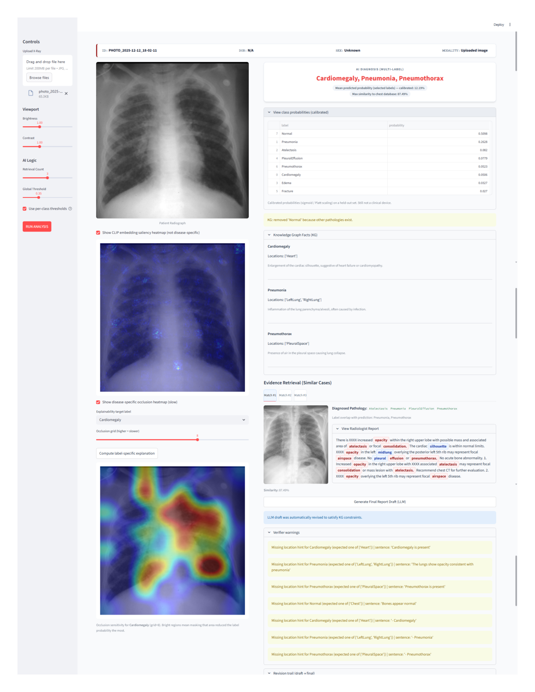
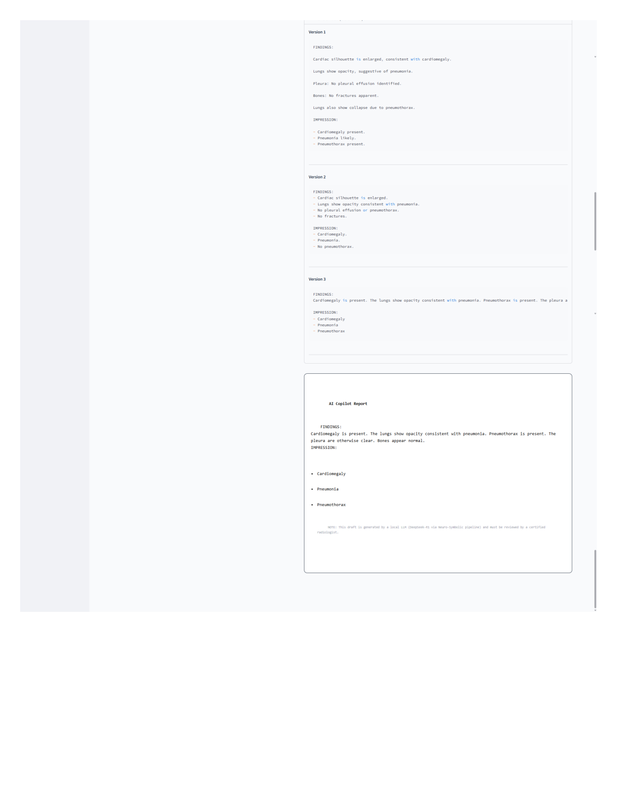
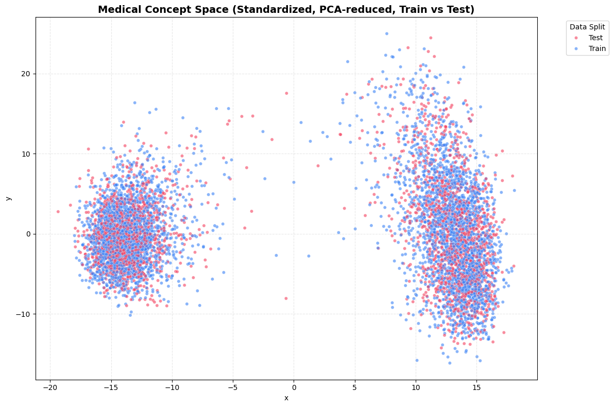
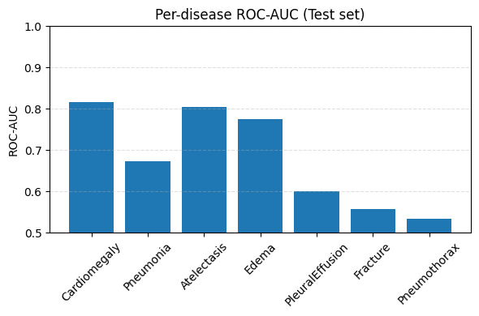
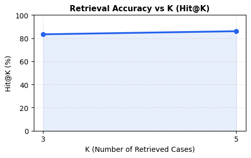
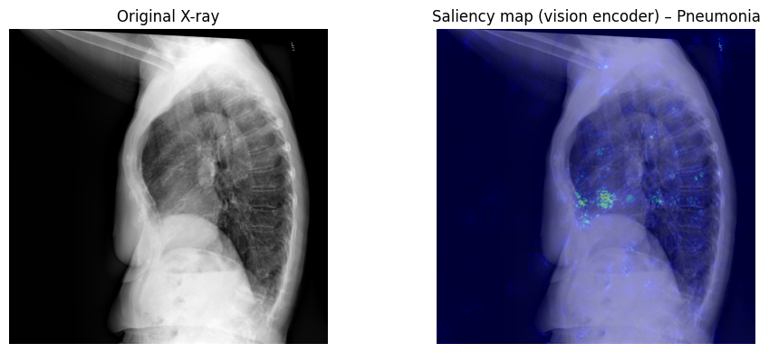

# MedVision PACS — Neuro-Symbolic RAG for Chest X‑Ray Reporting

> **Authors:** Daniel Noroozi, Samira Sadeghi  

## What this project does
**MedVision PACS** is a lightweight research prototype that takes an uploaded **chest X‑ray** and produces:
1) **Multi‑label pathology predictions** (e.g., Cardiomegaly, Pneumonia, Pneumothorax)  
2) **Evidence retrieval (RAG)** by finding the most similar cases from an embedded chest X‑ray dataset  
3) **Knowledge‑Graph (KG) facts** for predicted diseases (definitions + typical locations)  
4) A **local LLM report draft** (DeepSeek‑R1 via Ollama) constrained by neuro‑symbolic rules  
5) **Post‑hoc verification** that flags hallucinations / contradictions against predicted labels & KG rules  
6) **Explainability heatmaps** (CLIP saliency + disease‑specific occlusion sensitivity)

A snapshot of the final Streamlit dashboard is available in `FinalDashboard.pdf` and exported screenshots under `assets/`.

## Demo (Dashboard)



## System overview
**Input:** a chest radiograph (JPG/PNG)  
**Core steps:**
- **BiomedCLIP embeddings**: encode the image into a normalized vector representation
- **Multi‑label classifier**: One‑vs‑Rest classifier trained on dataset embeddings
- **Probability calibration** (optional): per‑class Platt scaling (sigmoid) to make scores less “raw”
- **Thresholding**: global threshold or **per‑class thresholds** tuned on a validation split
- **RAG retrieval**: cosine similarity search over the embedding database; retrieve top‑k similar cases
- **KG grounding**: rdflib‑based Turtle KG provides definitions + anatomy hints
- **LLM report draft**: local LLM generates *FINDINGS* + *IMPRESSION* using only allowed labels
- **Verifier**: detects “present-but-not-predicted”, “absent-but-predicted”, out‑of‑scope labels, and weak location hints
- **XAI**:
  - image‑only CLIP saliency (not disease‑specific)
  - **disease‑specific occlusion heatmap** (slow but model‑agnostic)

---

## Screenshots

### Notebook visuals (selected)









---
## Quickstart

### 1) Create environment
**Option A — pip**
```bash
python -m venv .venv
# Windows:
.venv\Scripts\activate
# macOS/Linux:
source .venv/bin/activate

pip install -r requirements.txt
```

**Option B — conda**
```bash
conda env create -f environment.yml
conda activate medvision
```

### 2) Generate artifacts (run notebook)
Open and run:
- `AI RAG-train-test-split -Final.ipynb`

This will create the `.pkl` files + `medical_kg_comprehensive.ttl` required by the app. Run the notebook in `notebooks/` to build these artifacts for your dataset.

### 3) Run the Streamlit app
```bash
streamlit run app_final_updated_Final.py
```

## Local LLM (optional): DeepSeek‑R1 via Ollama
The app can draft the final report using a **local** LLM endpoint.

1) Install Ollama  
2) Pull the model:
```bash
ollama pull deepseek-r1:latest
```
3) Ensure the Ollama server is running (default: `http://localhost:11434`)  
4) In the app, click **Generate Final Report Draft (LLM)**

If Ollama is not available, the app still runs; only the LLM draft step will error gracefully.

## Notes on safety & limitations
This is a **research / educational prototype** and **not a medical device**.
- Output reports are **drafts** and must be reviewed by a qualified clinician.
- Thresholding and calibration reduce some failure modes, but **false positives/negatives remain**.
- The verifier is intentionally simple and transparent; it catches common hallucinations, not all errors.

## Acknowledgments
- Built with **Streamlit**, **PyTorch**, **open_clip**, **scikit‑learn**, and **rdflib**.
- Vision backbone: **BiomedCLIP** (via `open_clip` HF hub model loading).
